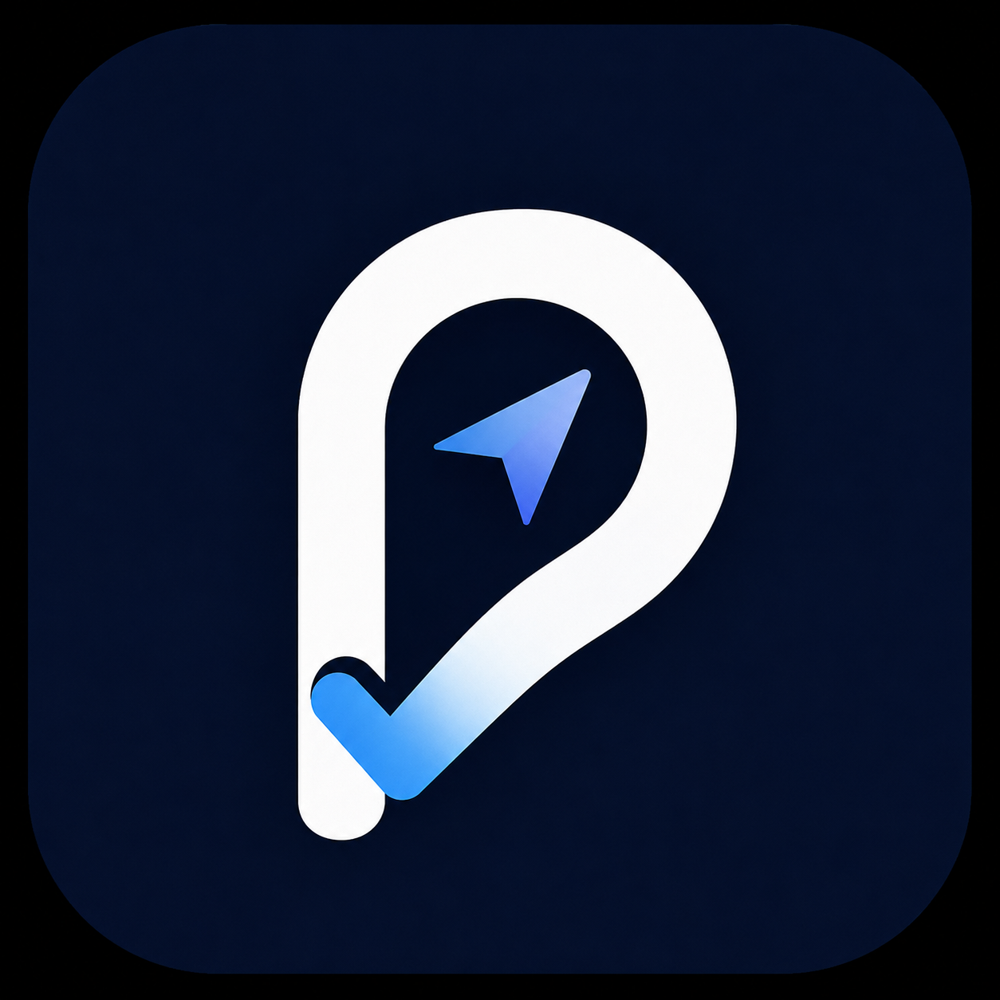
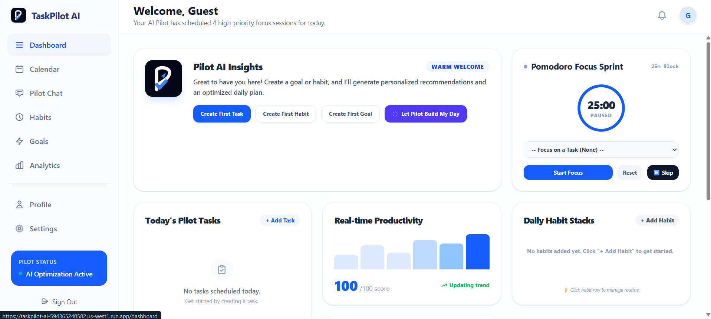
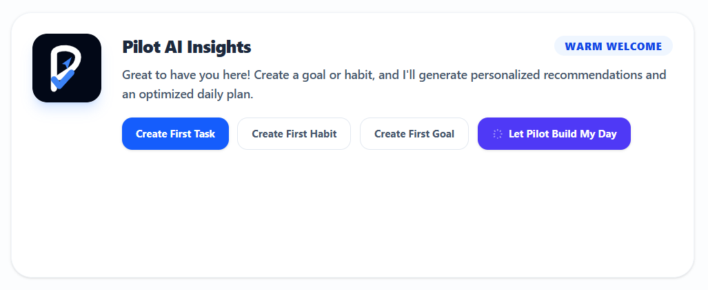
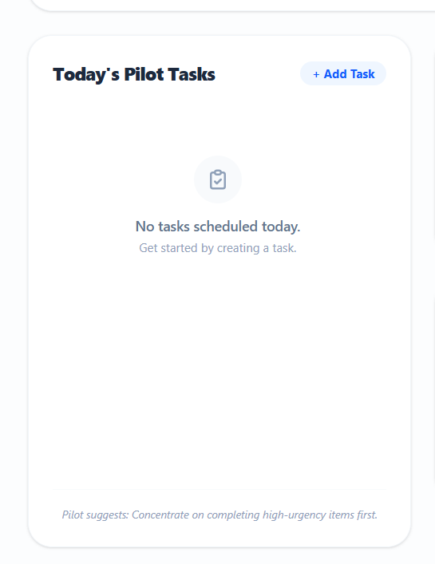
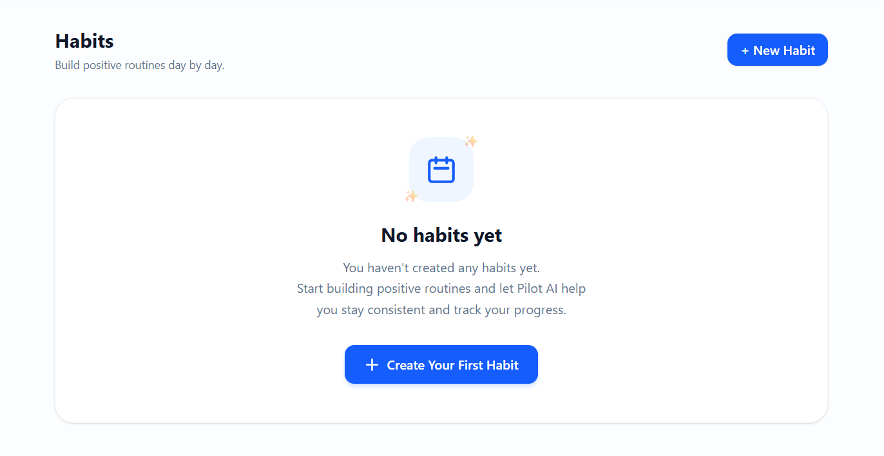
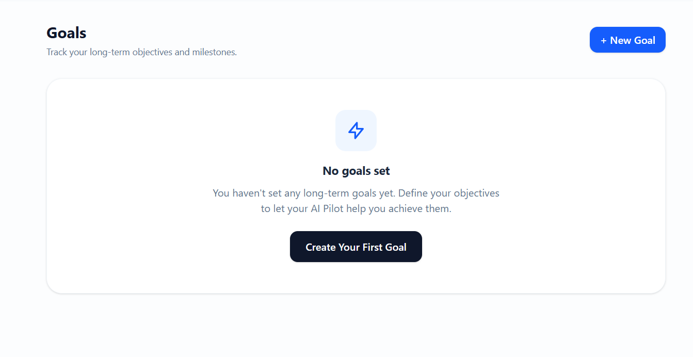
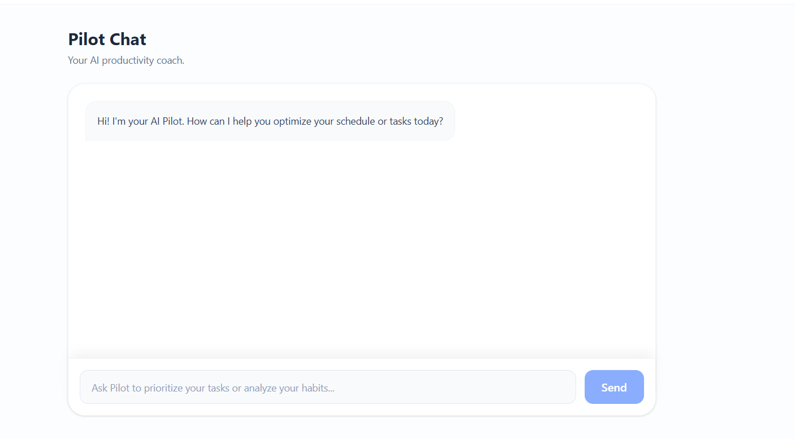
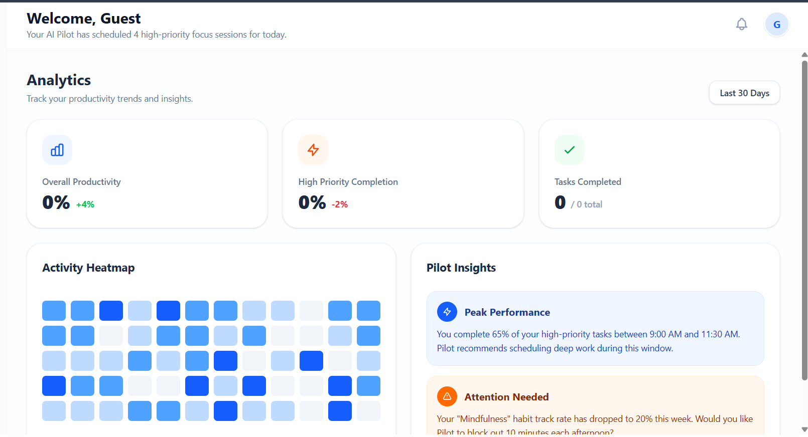
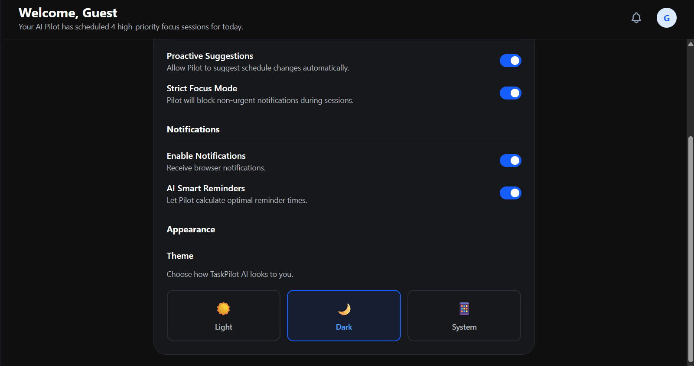

# 🚀 TaskPilot AI

<div align="center">



# 🚀 TaskPilot AI

### Your AI-Powered Productivity Companion

Plan smarter. Build better habits. Achieve your goals with AI.

Built using **Google Gemini AI**, **Firebase**, **Next.js**, and **Google Cloud**.

</div>


# 📖 Overview

TaskPilot AI is an AI-powered productivity platform that helps users intelligently manage their tasks, habits, goals, and daily schedules.

Unlike traditional to-do applications, TaskPilot AI uses **Google Gemini AI** to understand the user's workload, deadlines, productivity patterns, and available time to generate personalized recommendations, optimized schedules, and actionable insights.

Whether you're a student, professional, or anyone looking to improve productivity, TaskPilot AI acts as your personal AI productivity coach.

---

# 🎯 Problem Statement

Managing daily work, deadlines, habits, and long-term goals is often overwhelming.

Most productivity applications only store information but fail to provide intelligent guidance.

TaskPilot AI solves this by using Artificial Intelligence to:

- Prioritize work automatically
- Build optimized daily schedules
- Recommend the best time to complete tasks
- Track habits intelligently
- Monitor goal progress
- Provide personalized productivity insights

---

# ✨ Features

## 📝 Smart Task Management

- Create, edit and delete tasks
- AI-based priority suggestions
- Estimated completion time
- Due dates and reminders
- Categories
- Subtasks
- Progress tracking

---

## 🔥 Habit Tracking

- Daily, Weekly and Monthly habits
- Habit streak tracking
- Progress monitoring
- Habit analytics
- AI habit recommendations

---

## 🎯 Goal Management

- Long-term goal tracking
- Milestone management
- Progress visualization
- Deadline monitoring
- AI roadmap generation

---

## 🤖 Pilot AI Insights

Pilot AI continuously analyzes:

- Pending tasks
- Goals
- Habits
- Calendar
- Deadlines
- Productivity trends

It provides:

- Personalized recommendations
- Daily planning
- Focus suggestions
- Productivity coaching
- Smart scheduling

---

## 💬 Pilot Chat

An AI assistant powered by **Google Gemini** that understands your productivity data and helps you:

- Plan your day
- Organize tasks
- Prioritize work
- Improve productivity
- Answer productivity-related questions

---

## 📊 Productivity Dashboard

Interactive dashboard displaying:

- Productivity Score
- Today's Tasks
- Today's Habits
- Goal Progress
- AI Insights
- Analytics
- Smart Recommendations

---

## 📅 Calendar Integration

- Daily schedule
- Upcoming deadlines
- Task timeline
- Habit reminders
- AI-generated daily plans

---

## ☁ Cloud Sync

Authenticated users can securely sync:

- Tasks
- Habits
- Goals
- Settings

using Firebase Cloud Firestore.

Guest Mode stores data locally.

---

## 🌙 Modern UI

- Responsive Design
- Mobile-first interface
- Dark Mode
- Light Mode
- Bottom Navigation (Mobile)
- Desktop Sidebar
- Smooth animations

---

# 🧠 AI Capabilities

TaskPilot AI uses **Google Gemini AI** to provide:

- Intelligent task prioritization
- Smart scheduling
- Personalized productivity insights
- Habit improvement suggestions
- Goal planning
- Milestone generation
- AI coaching
- Dynamic daily recommendations
- Context-aware Pilot Chat

The AI analyzes:

- User tasks
- Goals
- Habits
- Calendar
- Productivity history
- Deadlines

to generate personalized responses instead of generic advice.

---

# 🛠 Tech Stack

### Frontend

- Next.js
- React
- TypeScript
- Tailwind CSS

### Backend

- Firebase Authentication
- Cloud Firestore

### Artificial Intelligence

- Google Gemini AI

### Cloud

- Google Cloud
- Firebase Hosting

### Authentication

- Email & Password
- Google Sign-In
- Guest Mode

---

# 🏗 Architecture

```
                 Google Gemini AI
                       │
                       │
                AI Insights Engine
                       │
                       ▼
      ┌────────────────────────────────┐
      │         TaskPilot AI           │
      └────────────────────────────────┘
            │       │         │
            │       │         │
        Tasks    Habits    Goals
            │       │         │
            └───────┼─────────┘
                    │
              Productivity Engine
                    │
                    ▼
            Firebase Firestore
                    │
                    ▼
          Firebase Authentication
```

---

# 📸 Screenshots

## 🏠 Dashboard
<p align="center">

</p>

## 🤖 Pilot AI Insights
<p align="center">

</p>

## 📝 Task Management
<p align="center">

</p>

## 🔥 Habit Tracking
<p align="center">

</p>

## 🎯 Goal Management
<p align="center">

</p>

## 💬 Pilot Chat
<p align="center">

</p>

## 📊 Analytics
<p align="center">

</p>

## 🌙 Dark Mode
<p align="center">

</p>
---

# 🚀 Live Demo

**Application**

> Add Deployment Link Here

---

# 📂 GitHub Repository

> Add GitHub Repository Link Here

---

# ⚙ Installation

Clone the repository

```bash
git clone https://github.com/yourusername/taskpilot-ai.git
```

Install dependencies

```bash
npm install
```

Create

```
.env.local
```

Add

```env
GEMINI_API_KEY=YOUR_GEMINI_API_KEY

NEXT_PUBLIC_FIREBASE_API_KEY=...

NEXT_PUBLIC_FIREBASE_AUTH_DOMAIN=...

NEXT_PUBLIC_FIREBASE_PROJECT_ID=...

NEXT_PUBLIC_FIREBASE_STORAGE_BUCKET=...

NEXT_PUBLIC_FIREBASE_MESSAGING_SENDER_ID=...

NEXT_PUBLIC_FIREBASE_APP_ID=...
```

Run the project

```bash
npm run dev
```

---

# 📈 Future Enhancements

- AI Calendar Sync
- Google Calendar Integration
- Microsoft Outlook Integration
- Smart Notification Engine
- AI Time Blocking
- Voice Assistant
- Mobile App
- Team Collaboration
- Shared Workspaces
- AI Weekly Reports

---

# 👨‍💻 Developer

## Ritwij

Computer Science Engineering Student

JECRC University

Built with ❤️ using Google AI Studio.

---

# 🙏 Acknowledgements

- Google AI Studio
- Google Gemini AI
- Firebase
- Google Cloud
- Next.js
- React
- Tailwind CSS

---

# 📄 License

This project is created for educational and hackathon purposes.

---

<div align="center">

### ⭐ If you like this project, consider giving it a star!

**TaskPilot AI • Built with ❤️ by Ritwij**

</div>
